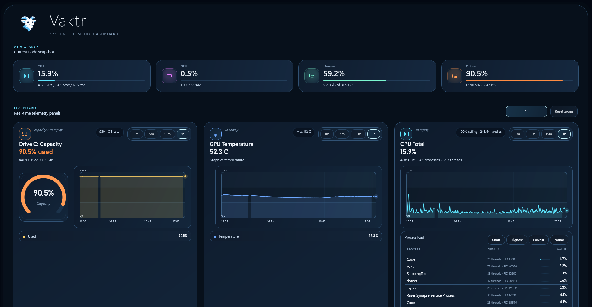
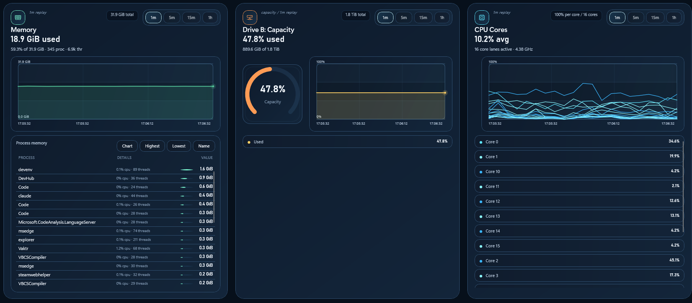
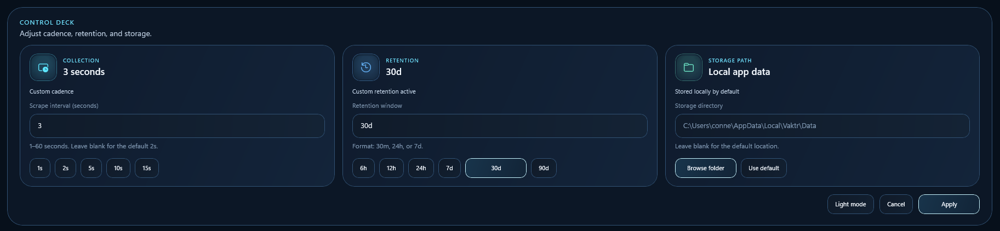

# Vaktr

**Real-time system monitoring. Zero setup. Runs on your PC.**

Vaktr is a local-first Windows telemetry dashboard that shows you what your PC is doing — right now and over time. Live time-series charts, per-process breakdowns, and at-a-glance summaries, all without sending a single byte to the cloud.



## Why Vaktr?

**Task Manager** gives you a snapshot but no history. **Resource Monitor** is overwhelming. **Server monitoring stacks** are powerful but require setup, configs, and infrastructure.

Vaktr gives you **beautiful real-time charts, historical data, and zero configuration.** Install it, run it, done.

## Who It's For

- **Gamers** — see what's eating your frames while you play
- **Creators** — monitor CPU/GPU load during renders and exports
- **Developers** — watch resource usage during builds, tests, and profiling
- **Power users** — understand your PC's behavior patterns over hours and days
- **IT professionals** — quick local diagnostics without deploying infrastructure

## What You See



### At a Glance
Four summary cards at the top with live utilization gauges — CPU, GPU, Memory, and Drives. Color-coded thresholds: green under 75%, yellow 75-90%, orange over 90%.

### Live Board
Drag-and-drop telemetry panels with real-time time-series charts:

| Metric | What's Tracked |
|--------|---------------|
| **CPU** | Total usage, per-core breakdown (sorted numerically), clock frequency |
| **GPU** | Utilization, dedicated VRAM usage, temperature |
| **Memory** | Used/available with percentage and accurate total from hardware |
| **Disk** | Read/write throughput per drive, capacity gauges |
| **Network** | Download/upload per interface |
| **Processes** | Per-process CPU and memory with sortable tables and chart overlay |

**Chart features:**
- Zoom via click-drag selection or quick range presets (1m, 5m, 15m, 1h, 2d, 5d, 7d, 30d, 90d, 1y)
- Click a data point to pin a static tooltip with timestamp and values
- Click a legend entry to isolate a single series for focused analysis
- Panels freeze when zoomed into historical data so you can inspect without it shifting
- Timestamps show dates when viewing data from previous days
- Double-click to reset zoom and clear pinned tooltips

Panels can be reordered by dragging.

### Control Deck



Adjust scrape cadence (1-60 seconds), data retention (30 minutes to 90 days), storage location, and theme — all from one place.

## Install

### Download
Grab the latest installer from [Releases](https://github.com/WyrickC/Vaktr/releases):
- **VaktrSetup-x64.exe** — Intel/AMD 64-bit (most PCs)
- **VaktrSetup-ARM64.exe** — ARM-based Windows devices (Surface Pro X, Copilot+ PCs)

Run it. That's it.

### Build from Source

```powershell
git clone https://github.com/WyrickC/Vaktr.git
cd Vaktr
dotnet restore Vaktr.sln
dotnet run --project Vaktr.App/Vaktr.App.csproj -p:Platform=x64
```

Or open `Vaktr.sln` in Visual Studio, set `Vaktr.App` as startup, choose **Debug | x64**, and press **F5**.

## Requirements

- Windows 10 1809+ (build 17763)
- .NET 8 (bundled in the installer)
- x64 or ARM64 processor

## How It Works

```
Vaktr.Core        Models, enums, interfaces
Vaktr.Collector   PDH counters, WMI, LibreHardwareMonitor, process enumeration
Vaktr.Store       SQLite persistence (WAL mode) + JSON config
Vaktr.App         WinUI 3 desktop shell
```

1. A background collector samples hardware counters every 2 seconds (configurable)
2. Snapshots are stored in a local SQLite database with automatic retention pruning
3. The UI updates live via dispatcher queue — charts, gauges, and process tables refresh in real time
4. Deterministic min/max downsampling ensures stable, flicker-free chart rendering at any zoom level

All data stays on your machine. No network calls, no telemetry, no cloud.

## Defaults

| Setting | Default |
|---------|---------|
| Scrape interval | 2 seconds |
| Graph window | 15 minutes |
| Retention | 24 hours |
| Storage | `%LocalAppData%\Vaktr\Data` |
| Theme | Dark |

## Privacy

Vaktr is **completely local**. It does not:
- Make any network requests
- Send telemetry or analytics
- Phone home for updates
- Access files outside its own storage directory

Your hardware data never leaves your PC.

## Roadmap

See [ROADMAP.md](ROADMAP.md) for planned features including CPU temperature monitoring, panel resizing, notifications, data export, Prometheus metrics endpoint, and in-game overlay.

## License

See [LICENSE](LICENSE) for details.
